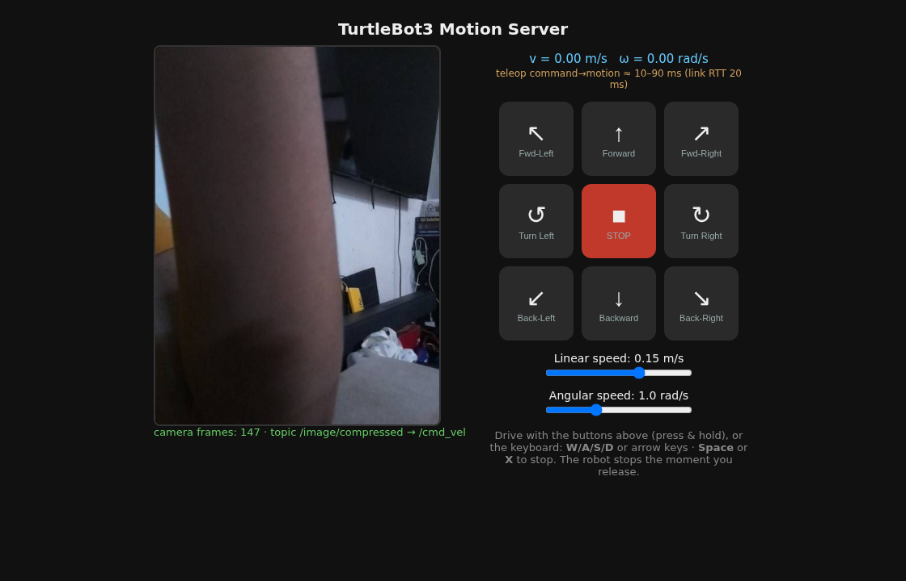

# TurtleBot3 Motion Server

A web app that lets you **drive a TurtleBot3 from your browser** and **watch its
camera** live. It runs on a laptop and talks to the robot over Wi-Fi using ROS 2.



## What's in here

| File | Purpose |
|------|---------|
| `motion_server.py`  | The whole app: ROS 2 node + web server + GUI (one file). |
| `run_server.sh`     | Starts the server on the laptop using values from `.env`. |
| `scripts/robot_start.sh` | Starts the robot's ROS nodes (motors + camera) over SSH. |
| `scripts/robot_stop.sh`  | Stops the robot's ROS nodes (leaves it powered on). |
| `.env.example`      | Template for configuration. Copy to `.env` and edit. |
| `fastdds_unicast.xml` | Optional fallback for networks that block multicast. |
| `robot/`            | Reference snapshot of the **robot-side** files (camera node, `start_all.sh`). See `robot/README.md`. |
| `docs/`             | Full LaTeX documentation and the compiled **PDF**. |

> **Read `docs/turtlebot3_motion_server.pdf` for the complete, beginner-friendly
> guide** (assumes no ROS knowledge).

## Quick start

```bash
# 1. Configure
cp .env.example .env      # then edit .env with your robot IP, password, etc.

# 2. Start the robot's nodes (motors + camera)
./scripts/robot_start.sh

# 3. Start the web server on the laptop
./run_server.sh

# 4. Open the GUI
#    http://localhost:8000
```

Drive with the on-screen buttons or **W/A/S/D** / arrow keys. Release to stop.

## ROS 2 topics

The laptop and robot talk over **topics** — named channels carrying typed
messages. Topics are *not* declared in config files; a node creates one in code
and it appears on the network. Everything below is live when the robot is up
(`ROS_DOMAIN_ID=203`).

This app uses only two of them: it **reads** `/image/compressed` and **writes**
`/cmd_vel`. The rest are published by the standard bringup and are available if
you want to extend things.

| Topic | Message type | Direction | Published by |
|-------|--------------|-----------|--------------|
| `/cmd_vel` | `geometry_msgs/msg/Twist` | laptop → robot | **this app** (drives the motors) |
| `/image/compressed` | `sensor_msgs/msg/CompressedImage` | robot → laptop | `image_publisher` (custom, see `robot/`) |
| `/odom` | `nav_msgs/msg/Odometry` | robot → laptop | `diff_drive_controller` |
| `/scan` | `sensor_msgs/msg/LaserScan` | robot → laptop | `hlds_laser_publisher` (LDS-01 lidar) |
| `/imu` | `sensor_msgs/msg/Imu` | robot → laptop | `turtlebot3_node` |
| `/magnetic_field` | `sensor_msgs/msg/MagneticField` | robot → laptop | `turtlebot3_node` |
| `/battery_state` | `sensor_msgs/msg/BatteryState` | robot → laptop | `turtlebot3_node` |
| `/joint_states` | `sensor_msgs/msg/JointState` | robot → laptop | `turtlebot3_node` |
| `/sensor_state` | `turtlebot3_msgs/msg/SensorState` | robot → laptop | `turtlebot3_node` |
| `/tf`, `/tf_static` | `tf2_msgs/msg/TFMessage` | robot → laptop | `robot_state_publisher` |
| `/robot_description` | `std_msgs/msg/String` | robot → laptop | `robot_state_publisher` |

`/cmd_vel` carries a `Twist`, of which the robot uses two fields: `linear.x`
(forward, m/s) and `angular.z` (turn, rad/s). A Burger tops out at 0.22 m/s and
2.84 rad/s — the `MAX_LIN` / `MAX_ANG` values in `.env`.

There is also one **service** (request/response, not a topic) defined in
`robot/turtlebot3_image_motion/srv/Motion.srv`. It belongs to the upstream
Jetson stack and is unused by this app.

### Checking topics yourself

```bash
export ROS_DOMAIN_ID=203
ros2 topic list                  # what's out there
ros2 topic type /cmd_vel         # its message type
ros2 topic echo /odom            # watch messages live
```

> **If `ros2 topic list` shows only `/parameter_events` and `/rosout`**, it's
> almost always a stale ROS daemon, *not* a network problem. Run
> `ros2 daemon stop`, or add `--no-daemon` to the command. Note that
> `ros2 topic hz` does not accept `--no-daemon` on Humble. Discovery can also
> take 20-30 s to settle after launch.

## Security

Real secrets (the robot SSH password) live in `.env`, which is **git-ignored**
and never pushed. Only `.env.example` (placeholders) is committed.
